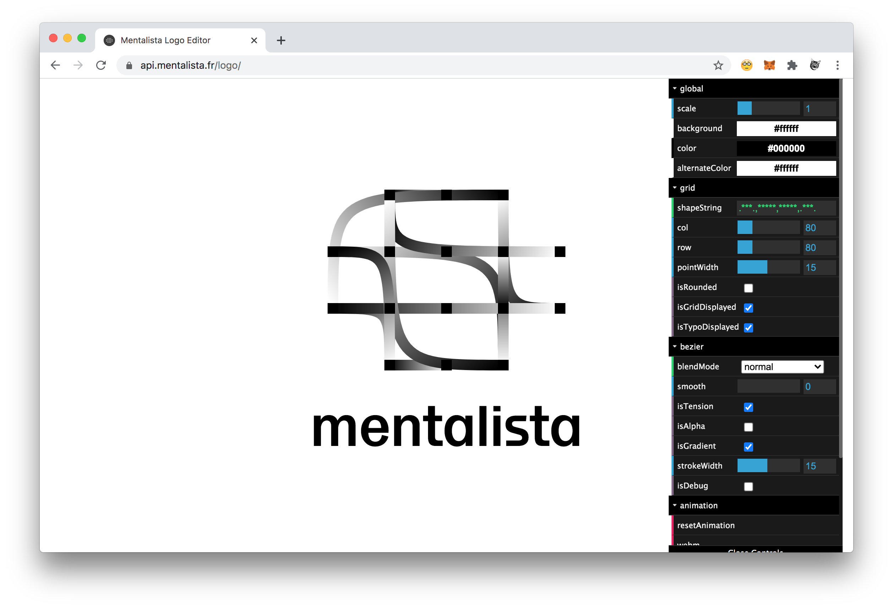

## Mentalista 2D Logo Editor

###### Description

The visual identity of [mentalista](https://mentalista.fr/en/) uses brain waves to generate itself. The logo consists of a matrix of fixed points, each representing an area of the brain. This matrix is based on the [10-20 system](https://en.wikipedia.org/wiki/10%E2%80%9320_system_(EEG)), a convention for placing electrodes on the skull for measuring brain waves. On the logo, neural activity is reflected by the connection of the points between them. The path from one point to another is represented by a line of a degraded color connecting one area of the brain to another.

The color, scale and even the thickness of the lines and dots are adjustable in an [editor accessible online](https://api.mentalista.fr/logo/). It allows to generate the logo according to the needs of the graphic charter.

###### Gallery
